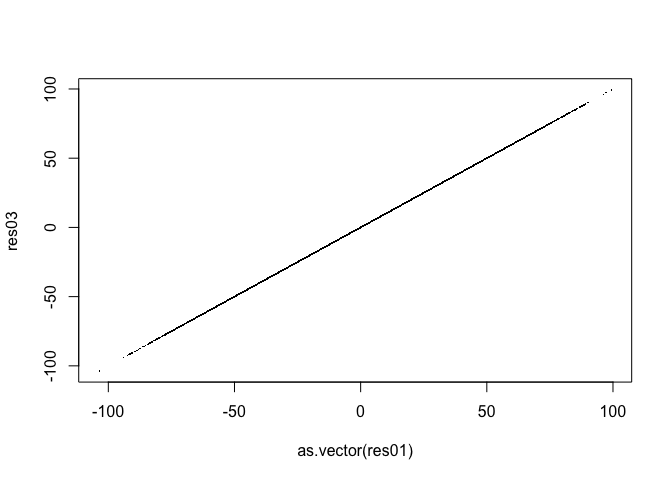

ardea 0.0.3
================
Nicholas Cooley
2026-09-16

- [Introduction](#introduction)
- [Installation](#installation)
  - [OpenCL](#opencl)
  - [Metal](#metal)
  - [CUDA](#cuda)
  - [Other](#other)
- [Example Code](#example-code)

# Introduction

*Currently under construction! This package works on at least one mac,
and one server running an A30.* *CRAN submission will be happening
soon!*

This package is an attempt at building out infrastructure for users to
dispatch code directly to GPU devices in R. The package uses OpenCL as
an ‘parent’ capability requirement, allowing it to build on machines
regardless of device vendor, or on machines that do not have a device
present.

This package is currently designed to work wherever R works. During
installation, it probes the system for the ability to successfully
compile and run simple `Hello World` style device probes for target
frameworks and their devices. Capabilities for specific frameworks are
only compiled if the tooling for those frameworks is successfully
detected.

Because I do not have a Windows development environment, Windows is not
currently supported.

# Installation

`ardea` goes through a fair amount of gymnastics to detect capabilities
and manage installation. The `ARDEA_<FRAMEWORK>_<KEYWORD>` environment
variables that the configure script ingests if present are used *during
build*, so users can hypothetically build out containers that may land
on diverse resources where these can be re-set for the new environment.

## OpenCL

OpenCL is an open source standard for interacting with GPUs and other
alternative compute devices, regardless of vendor. On Macs, this
framework is not current, and does not appear to be updateable *but does
work still*. On Linux systems, default OpenCL installations should be
detected automatically over the course of package installation. If they
are not, or users have a non-standard installation, `ardea` checks for
user environment variables:

- **ARDEA_OPENCL_LIBS**
- **ARDEA_OPENCL_INCLUDE**

to specify library and linker locations.

## Metal

Metal is Apple’s framework for interacting with GPUs and builtin devices
within their ecosystem. If the package detects Darwin as the OS, Metal
detection is triggered. Metal has gone through a few changes as Apple
has used a few different device vendors over the years and though its
most recent iteration appears focused on Silicon series chips.

Metal capabilities in this package were originally built out in the
[ACFmetal](https://github.com/npcooley/ACFmetal) github only R package.

## CUDA

CUDA is NVIDIA’s framework for interacting with NVIDIA devices. Because
CUDA installations have so many different flavors and many of their own
peculiarities, CUDA support *requires* user environment variables:

- **ARDEA_CUDA_LIBS**
- **ARDEA_CUDA_STUBS**
- **ARDEA_CUDA_INCLUDE**

These must point to the library, linker, and stubs directories of a
functioning CUDA installation, and CUDA’s `NVCC` compiler must be
present in R’s `PATH`. Package installation will check for successful
compilation, and CUDA capabilities will be enabled if *compilation* for
the probe programs is successful, an existing device is not required.

CUDA capabilities in this package were originally built out in the
[ACFcuda](https://github.com/npcooley/ACFcuda) github only R package.

## Other

There are at least two other major frameworks (for AMD and Intel
devices) that may be added in the future, should folks find this package
to be useful. Right now the focus for this package is on hardening the
codebase to avoid build errors and bugs, and ensuring that functionality
is clearly described and accessible to typical R users.

# Example Code

`ardea` provides access to GPU devices and frameworks natively in R. It
currently provides rudimentary access to `OpenCL`, `CUDA`, and `Metal`;
letting users compile, test, and implement their own device specific
code. `ardea` currently only *requires* existing OpenCL to install
appropriately, but will selectively build out access to frameworks and
devices that it can detect during package installation.

This package currently does not provide an interface for vendor supplied
libraries. Functionality is currently focused on ingesting a user
supplied framework specific function, compiling that function and
preparing it for dispatch, executing function dispatch and buffer
management, and returning that function’s result to R.

``` r
library(ardea)

opencl_is_available()
```

    ## [1] TRUE

``` r
cuda_is_available()
```

    ## [1] FALSE

``` r
metal_is_available()
```

    ## [1] TRUE

Using matrix multiplication as an example, a user can bring a naive mm
kernel function conforming to the a given framework’s rules and
requirements. In this case we can just write out our functions to temp
files, and walk them forward through the frameworks and devices
available on the current system. One of `ardea`’s current quirks is that
it expects **the first argument of a function to be the output**. There
is no keyword or tooling to enforce this, but the underlying buffer
management currently only returns that first input from the device to R.

``` r
# write out a character vector to a tempfile for opencl, metal, and cuda
opencl_mm_naive <- '
__kernel void opencl_mm_naive(__global float* output,
                              const long M,
                              const long K,
                              const long N,
                              __global const float* A,
                              __global const float* B)
{
    long row = get_global_id(0);
    long col = get_global_id(1);

    if (row < M && col < N) {
        float sum = 0.0f;
        for (long k = 0; k < K; k++) {
            sum += A[row + k * M] * B[k + col * K];
        }
        output[row + col * M] = sum;
    }
}
'
tmp_cl <- tempfile(fileext = ".cl")
writeLines(text = opencl_mm_naive,
           con = tmp_cl)

cuda_mm_naive <- '
extern "C" __global__ void cuda_mm_naive(float* output,
                                         const long long M,
                                         const long long K,
                                         const long long N,
                                         const float* A,
                                         const float* B)
{
    long long row = blockIdx.x * blockDim.x + threadIdx.x;
    long long col = blockIdx.y * blockDim.y + threadIdx.y;

    if (row < M && col < N) {
        float sum = 0.0f;
        for (long long k = 0; k < K; k++) {
            sum += A[row + k * M] * B[k + col * K];
        }
        output[row + col * M] = sum;
    }
}
'
tmp_cu <- tempfile(fileext = ".cu")
tmp_ptx <- tempfile(fileext = ".ptx")
writeLines(text = cuda_mm_naive,
           con = tmp_cu)

metal_mm_naive <- '
kernel void metal_mm_naive(device float* output [[buffer(0)]],
                           constant uint& M [[buffer(1)]],
                           constant uint& K [[buffer(2)]],
                           constant uint& N [[buffer(3)]],
                           device const float* A [[buffer(4)]],
                           device const float* B [[buffer(5)]],
                           uint2 id [[thread_position_in_grid]])
{
    uint row = id.x;
    uint col = id.y;

    if (row < M && col < N) {
        float sum = 0.0f;
        for (uint k = 0; k < K; k++) {
            sum += A[row + k * M] * B[k + col * K];
        }
        output[row + col * M] = sum;
    }
}
'
tmp_metal <- tempfile(fileext = ".metal")
tmp_metallib <- tempfile(fileext = ".metallib")
writeLines(text = metal_mm_naive,
           con = tmp_metal)
```

Matrix multiplication doesn’t need a lot of setup when using the builtin
`%*%` function, which is calling on your R installation’s BLAS library
and is highly optimized. However, because we’re reaching out to a device
almost entirely *ab initio* with no helpers, we need to perform the work
that those helpers would perform.

``` r
# generic inputs, regardless of framework
var00 <- vector(mode = "numeric",
                length = 250000)
var01 <- matrix(rnorm(250000),
                nrow = 500,
                ncol = 500)
var02 <- matrix(rnorm(250000),
                nrow = 500,
                ncol = 500)
dim01 <- nrow(var01)
dim02 <- ncol(var01)
# dim03 <- nrow(var02)
dim04 <- ncol(var02)

arg_list <- list(var00, # our expected output vector, we've just filled it with zeros
                 dim01,
                 dim02,
                 dim04,
                 as.vector(var01),
                 as.vector(var02))
```

Every framework has its own unique verbiage and intricacies, though
they’re all *kind of* doing similar things. OpenCL is designed to be be
deployable across a variety of device vendors and device *types*, not
just GPUs. Metal is Apple’s proprietary GPU / accelerator framework,
though it shares some conceptual choices with OpenCL as until recently
Apple’s hardware stack was somewhat diverse. CUDA is NVIDIA’s well known
framework for accessing their devices, and includes an intimidating
array of libraries and functionalities.

This means that frameworks share concepts, but not necessarily the same
keywords, type names, specific paths, or user interactions.

``` r
opencl_arg_types <- c("float",
                      "long",
                      "long",
                      "long",
                      "float",
                      "float")
metal_arg_types <- c("float",
                     "uint",
                     "uint",
                     "uint",
                     "float",
                     "float")
cuda_arg_types <- c("float",
                    "long",
                    "long",
                    "long",
                    "float",
                    "float")
```

Though each framework handles program / module / library preparation
somewhat uniquely, an effort has been made to unify how *users* interact
with these steps. In this package OpenCL supports API-side compilation
and program generation, while Metal supports both API-side, and
system-side compilation and program management, and CUDA *only* supports
system-side compilation. Meaning that under the hood Metal and CUDA are
calling on system/vendor-specific compilers to build their
libraries/modules (i.e. `clang` and `nvcc` respectively).

``` r
if (opencl_is_available()) {
  print("OpenCL is available on this system!")
  cl_dvcs <- opencl_device_information()
  cl_ctx <- opencl_make_context(device = cl_dvcs[[1]])
  cl_program <- opencl_make_program(cl_file = tmp_cl,
                                    context = cl_ctx)
  cl_knl <- opencl_make_kernelptr(program = cl_program,
                                  kernel_names = "opencl_mm_naive")
}
```

    ## [1] "OpenCL is available on this system!"

``` r
if (cuda_is_available()) {
  print("CUDA is available on this system!")
  cu_dvcs <- cuda_device_information()
  cu_ctx <- cuda_make_context(device = cu_dvcs[[1]])
  cu_program <- cuda_make_program(cuda_file = tmp_cu,
                                  context = cu_ctx,
                                  ptx_file = tmp_ptx)
  cu_knl <- cuda_make_kernelptr(program = cu_program,
                                context = cu_ctx,
                                kernel_names = "cuda_mm_naive")
}
if (metal_is_available()) {
  print("Metal is available on this system!")
  mtl_dvcs <- metal_device_information()
  mtl_ctx <- metal_make_context(device = mtl_dvcs[[1]])
  mtl_program <- metal_make_program(metal_file = tmp_metal,
                                    metallib_file = tmp_metallib,
                                    context = mtl_ctx)
  mtl_knl <- metal_make_kernelptr(program = mtl_program,
                                  context = mtl_ctx,
                                  kernel_names = "metal_mm_naive")
}
```

    ## [1] "Metal is available on this system!"

A simple wrapper function is supplied with `ardea`, though it is mostly
a thin wrapper for `.Call()` runner functions. It does perform some
error checking, but for the most part users are being trusted with their
judgements.

``` r
# our builtin optimized CPU implementation
print("Builtin implementation:")
```

    ## [1] "Builtin implementation:"

``` r
system.time(res01 <- var01 %*% var02)
```

    ##    user  system elapsed 
    ##   0.031   0.001   0.031

``` r
if (opencl_is_available()) {
  print("OpenCL implementation:")
  print(system.time(res02 <- simple_wrapper(framework = "opencl",
                                            context_ptr = cl_ctx,
                                            kernel_ptr = cl_knl$opencl_mm_naive,
                                            arg_types = opencl_arg_types,
                                            arg_list = arg_list,
                                            problem_dims = as.integer(c(dim01,
                                                                        dim04,
                                                                        1L)),
                                            group_dims = NULL,
                                            workers_per = NULL)))
  plot(as.vector(res01),
       res02,
       pch = 46)
}
```

    ## [1] "OpenCL implementation:"
    ##    user  system elapsed 
    ##   0.002   0.002   0.017

<!-- -->

``` r
if (cuda_is_available()) {
  print("CUDA implementation:")
  print(system.time(res03 <- simple_wrapper(framework = "cuda",
                                            context_ptr = cu_ctx,
                                            kernel_ptr = cu_knl$cuda_mm_naive,
                                            arg_types = cuda_arg_types,
                                            arg_list = arg_list,
                                            problem_dims = as.integer(c(dim01,
                                                                        dim04,
                                                                        1L)),
                                            group_dims = NULL,
                                            workers_per = NULL)))
  plot(as.vector(res01),
       res03,
       pch = 46)
}
if (metal_is_available()) {
  print("Metal implementation:")
  print(system.time(res03 <- simple_wrapper(framework = "metal",
                                            context_ptr = mtl_ctx,
                                            kernel_ptr = mtl_knl$metal_mm_naive,
                                            arg_types = metal_arg_types,
                                            arg_list = arg_list,
                                            problem_dims = as.integer(c(dim01,
                                                                        dim04,
                                                                        1L)),
                                            group_dims = NULL,
                                            workers_per = NULL)))
  plot(as.vector(res01),
       res03,
       pch = 46)
}
```

    ## [1] "Metal implementation:"
    ##    user  system elapsed 
    ##   0.001   0.001   0.006

<!-- -->

This is currently the limit of `ardea`’s functionality. This package
began mostly as a curiousity project with Metal, and turning it into a
CRAN acceptable package became a bit of a labor of love. If folks find
this package useful I will consider expanding it to include other
vendors, or more complicated dispatch routines. As it stands now, my
primary concerns are conforming to CRAN submission guidelines, ensuring
user interactions are clear and predictable, and working through a
non-trivial TODO list.
